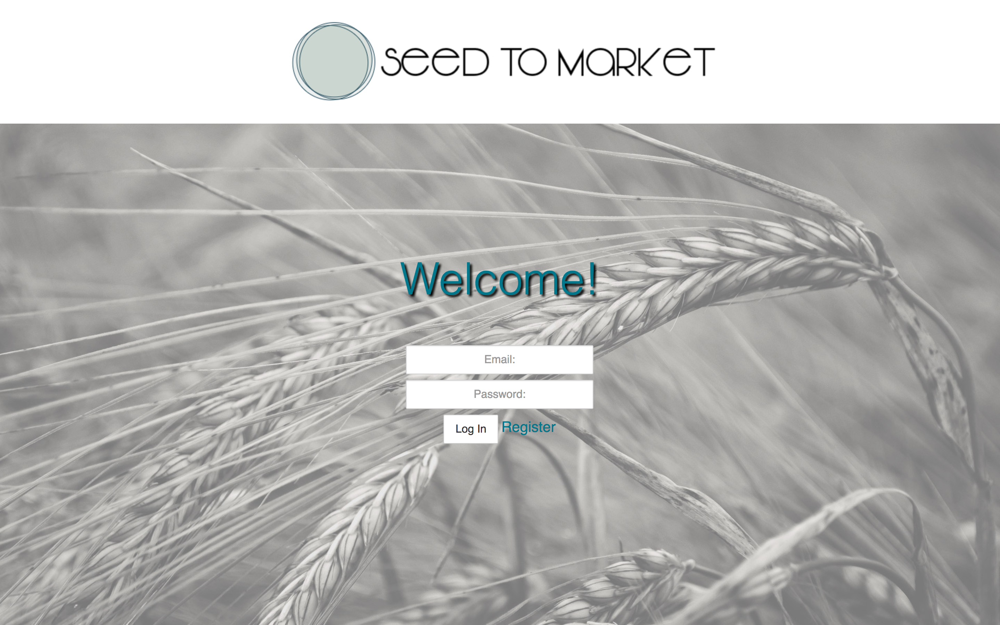
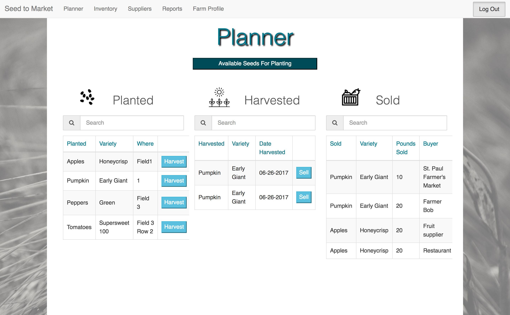
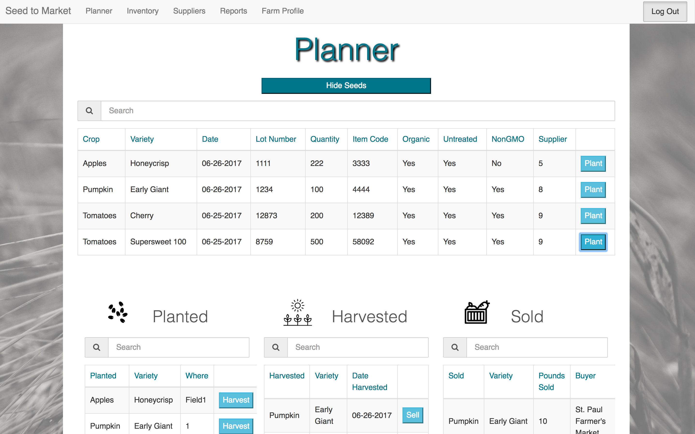
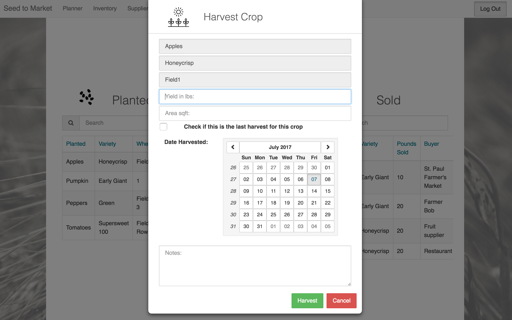
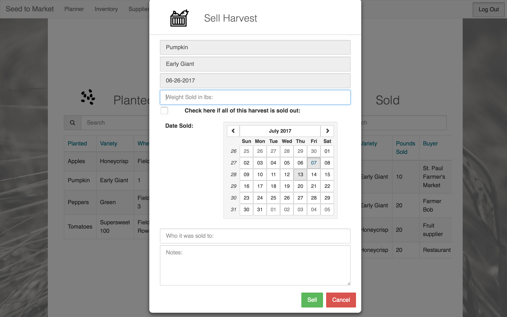
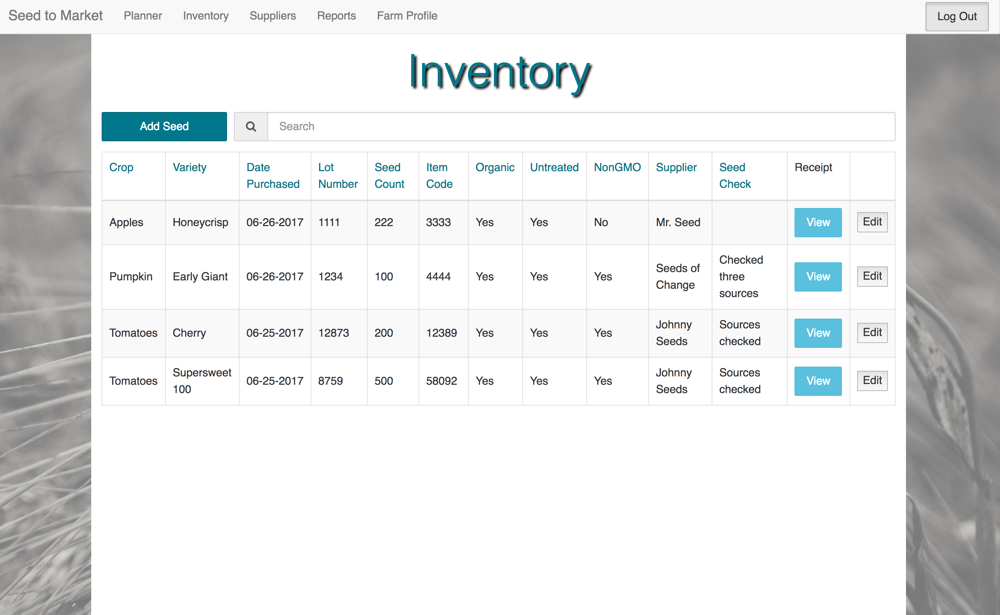
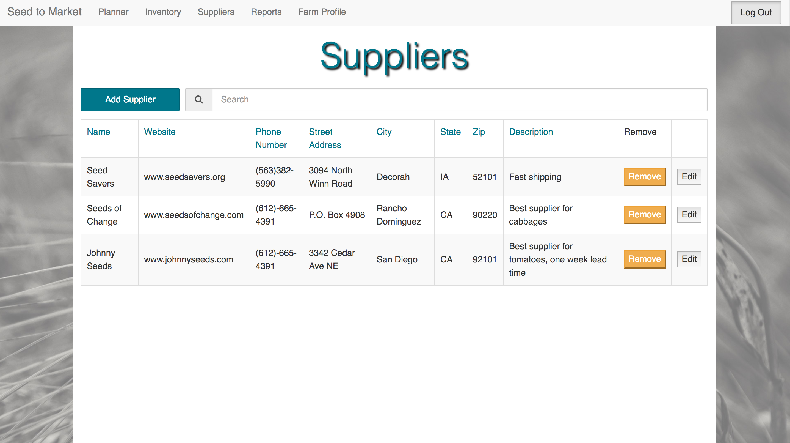
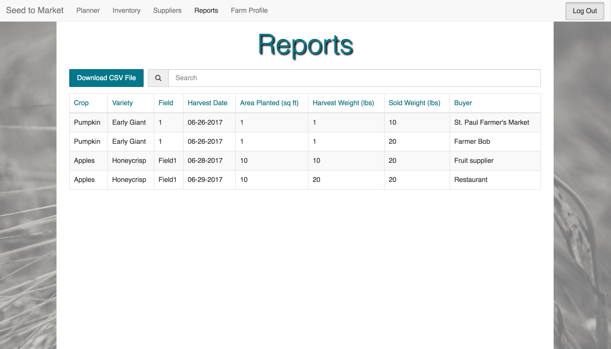

# Seed to Market
## Prime Digital Academy Full Stack Engineering Program - Group Project

## Description

Seed to Market is a full-stack web application to help small farms track crops and documentation to meet organic certification requirements.  It provides the user with the ability track a crops throughout the agricultural cycle -- from seed to plant, plant to harvest and harvest to final sale.  This data can then be used to generate reports for organic certification as well as inform planting decisions for future crops.

## Application Features
### Login

### Planner




### Inventory

### Suppliers

### Farm Profile

### Reports


##Getting Started

These instructions will get you a copy of the project up and running on your local machine for development and testing purposes.

### Prerequisites
You will need to have the following software installed:
* [Node.js](https://nodejs.org/en/)

* [PostgreSql](https://launchschool.com/blog/how-to-install-postgresql-on-a-mac)

* [Postico](https://eggerapps.at/postico/)

### Installing

Steps to get the development environment running.
1. Clone the repository to your local machine.
```
git clone https://github.com/
```
2. Install all dependencies.
```
npm install
```
3. Ensure PostgreSql is running.
```
brew services start postgresql
```
4. Spin up the Server.
```
npm start
```
5. Open in the browser.
```
localhost:5000
```

## Contributors
* Ryan Beadie
* Barb King
* Ben Lauderbaugh
* Amy Venturino

## Technologies
### Primary
* HTML5
* CSS3
* Bootstrap UI
* AngularJS
* Express
* Node.js
* Passport
* PostgreSQL
* Sweetalert
* Angular-xeditable
* FileStack
### Deployment
* Heroku

## Acknowledgments
* Our clients Cherry Flowers of Page and Flowers and Courtney Tchida manager of Cornercopia Student Organic Farm.
* The instructors and staff at Prime Digital Academy
